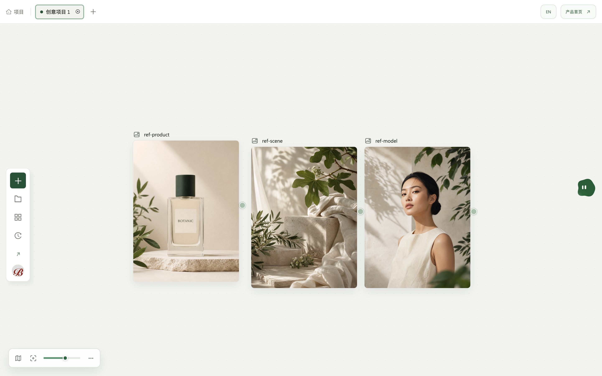
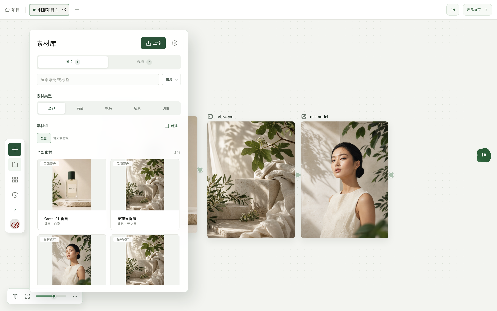
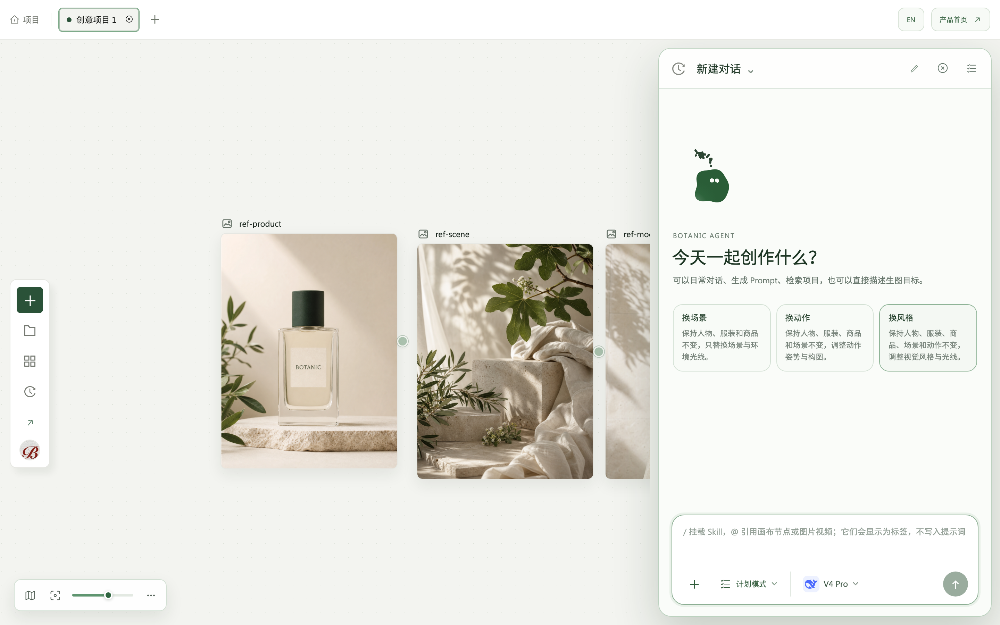

<a href="docs/images/canvas.png"></a>

**面向品牌视觉生产的无限画布工作台。**

Botanic 把商品图、参考素材、提示词和生成节点放在同一张画布上，用连线组成可以重复运行的工作流。提示词、模型参数、候选结果与执行血缘都写进项目文档，而不是留在某次对话里。

[打开线上工作台 →](https://botanic-canvas.vercel.app/)

## 画布就是工作流

素材、生成节点和结果节点用连线组织；改一处参数，整条链路的上下文都还在。

<a href="docs/images/canvas.png"></a>

## 项目级素材库

上传或粘贴进来的素材自动进入当前项目的素材库，按商品、模特、场景、调性归类，可搜索、可成组。

<a href="docs/images/library.png"></a>

## Botanic Agent

用自然语言描述目标，Agent 读取项目本体、画布关系与创作记忆后给出计划；`@` 引用画布节点，`/` 挂载 Skill。外部工具调用一律需要你确认。

<a href="docs/images/agent.png"></a>

## 能力一览

| 能力 | 怎么做到 | 为什么有用 |
| --- | --- | --- |
| 无限画布 | 图片、文本、生成、结果四类节点加自动连线 | 一次创作的全部上下文摊在同一个平面上，不靠记忆串联 |
| 多候选生成 | 每个候选落成独立结果节点 | 挑选和继续加工都在画布上进行，不必先导出再导入 |
| 图片生成 | GPT Image 2、MiniMax Image 01 | 同一份提示词可换模型重跑，参数留在节点上 |
| 视频生成 | MiniMax H3，支持首帧、首尾帧与参考素材，5 / 10 / 15 秒 | 静态素材与动态素材在同一个项目里流转 |
| 素材入画 | 文件拖放，或直接粘贴截图与网页图片 | 从看到一张参考图到它出现在画布上只有一步 |
| 提示词润色 | 服务端调用配置的文本模型 | 密钥留在服务端，浏览器拿不到 |
| 创作记忆 | 项目级记忆条目参与后续规划 | 品牌调性说过一次，不必每轮重述 |
| 工作流模板 | 保存节点、连线、提示词与当前生成设置 | 换一个商品复用同一套做法；模板不保存任务与结果 |
| 投放交付 | 素材更换、实时预览、安全区与多规格 ZIP 导出 | 从创作直接走到可交付物，不经过手工裁切 |
| 实时协作 | 项目级 WebSocket 推送与 Yjs 增量 | 多人同时改一张画布，跨 API 重启仍能恢复 |
| 离线草稿 | IndexedDB 本地草稿与远端版本冲突保护 | 网断了还能继续画，恢复时不覆盖别人的改动 |
| 执行血缘 | 每个结果记录来源任务、分支与输入素材 | 三周后仍能回答「这张图当时是怎么来的」 |

## 为什么这样做

对话式生图工具一次给你一张图。要改，就再描述一遍；要对比，就自己往上翻聊天记录；要复用上次那套做法，只能凭记忆重述。上下文留在对话里，而对话是会滚走的。

品牌视觉生产不是这个形状。一次投放要同一个商品的多个场景、多个模特、多种调性，彼此之间必须保持一致；下个月换商品还要复用同一套做法。所以 Botanic 把状态放在项目文档而不是对话里：画布上的连线就是工作流本身，参数挂在节点上，每个结果都记着自己的来源。

要点不在于生成得更快，而在于三周之后你还能回答「这张图当时是怎么来的」，并且照着重做一遍。

## 数据与密钥边界

- **生成模型的密钥只存在于服务端进程。** 浏览器不持有 OpenAI、MiniMax 或文本模型的密钥，也不直连它们。
- **MCP 工具走服务端精确白名单。** 每项必须声明 `server`、`tool` 与 HTTPS 地址；浏览器收不到 MCP 地址或凭据。外部工具调用仍需你逐次确认。
- **联网检索是可选的，且不由浏览器发起。** 未配置检索密钥时没有 `web_search`。
- **上传素材逐项校验**：单文件 8 MB 上限、MIME 与 PNG / JPEG / WebP 文件签名。参考图另有 8.29 MP 像素上限，以及 80 MP 解码上限用于防解压炸弹。
- **对象级授权走统一权限矩阵。** 工作区 Owner 管理成员与共享素材；项目 Owner / Editor / Viewer 分别对应管理、编辑与只读。实时票据、画布、润色与生成入口使用同一个授权入口。
- **变更写入持久化审计日志。** 成员、项目、共享素材与账户安全的改动都可追溯，Owner 可从账户菜单查看只读记录。
- 账户安全支持 TOTP 二步验证与「退出其他设备」。

## 运行环境

浏览器访问，无需安装。生产部署由 Vercel（Web）与 Railway（API / Worker）承载，媒体存于 S3 兼容对象存储。

```text
Vercel Web ── Railway API ── PostgreSQL
                  │
                  ├── Redis / BullMQ ── Worker ── OpenAI / MiniMax
                  └── S3 兼容对象存储
```

## 开发

代码不开源，不接受外部贡献。仓库内的开发约定与运行手册：

| 文档 | 回答什么问题 |
| --- | --- |
| [AGENTS.md](AGENTS.md) | 改代码前要遵守什么。**所有代码改动的入口** |
| [docs/DEVELOPMENT.md](docs/DEVELOPMENT.md) | 本地跑起来、环境变量、验证门禁、发布流程 |
| [docs/PRODUCT_ARCHITECTURE.md](docs/PRODUCT_ARCHITECTURE.md) | 产品由哪些概念构成（含 Agent Ontology 语义定义） |
| [docs/CODEMAP.md](docs/CODEMAP.md) | 某个行为的权威实现在哪个文件 |
| [docs/ARCHITECTURE.md](docs/ARCHITECTURE.md) | 模块接口与依赖方向，哪些依赖被禁止 |
| [docs/SECURITY_OPERATIONS.md](docs/SECURITY_OPERATIONS.md) | 上线验收、告警阈值、备份恢复 |

**贯穿全局的一条原则：UI 只表达交互，任务与持久化结果才是生成状态的权威来源。** 读代码时如果发现某个状态由组件内部推断得出，那通常是缺陷而不是设计。

本文档的截图由 `node scripts/captureDocShots.mjs` 生成。UI 改动后重跑该脚本即可，不要手工替换——手工截的图没人记得更新。

---

Copyright © 2026. 保留所有权利。本仓库为私有代码库，不授予任何使用、复制或分发许可。
