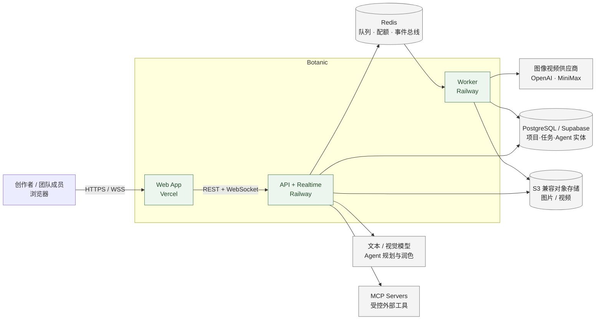
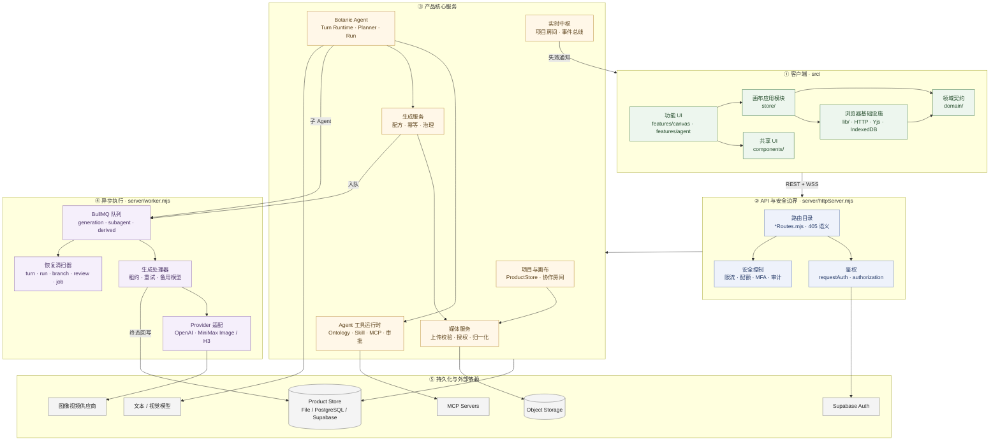
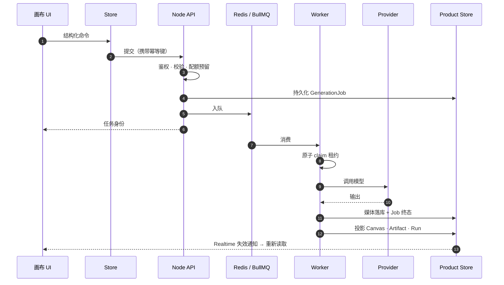
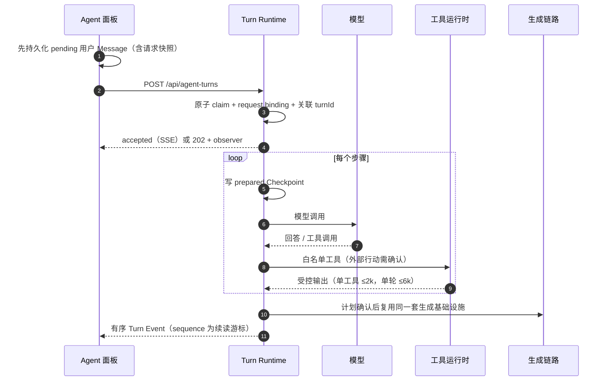
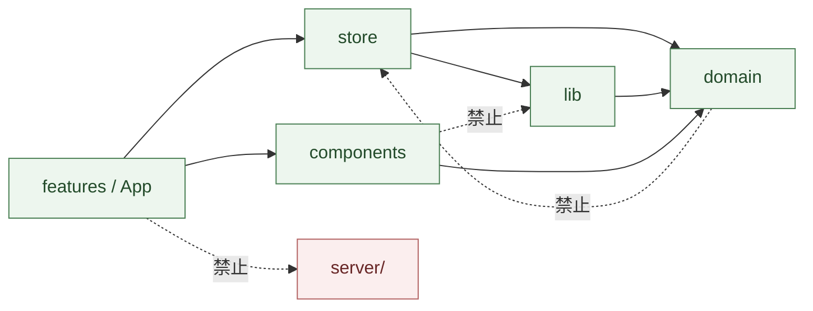
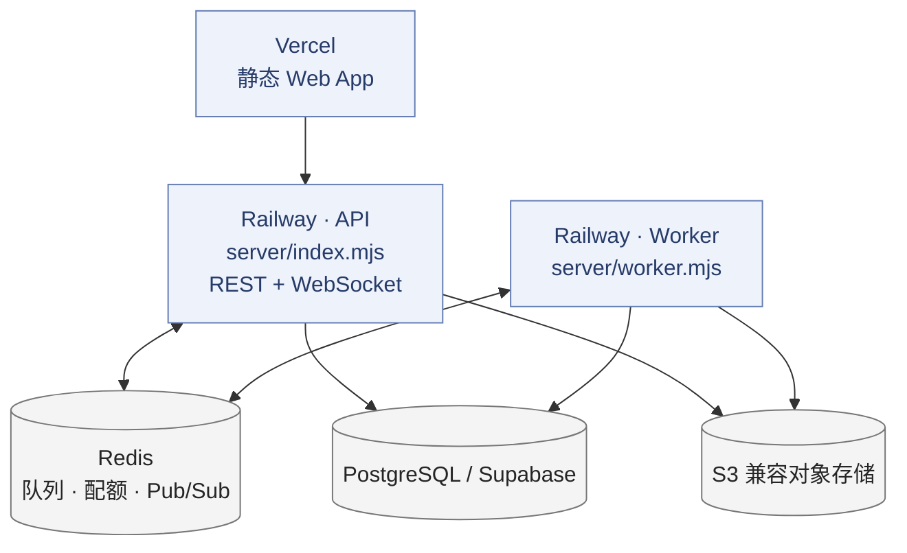

# Botanic 架构总览

一页看懂 Botanic 由哪些组件构成、它们分几层、数据怎么流动。

- 概念与语义定义 → [PRODUCT_ARCHITECTURE.md](PRODUCT_ARCHITECTURE.md)
- 模块接口与不变量 → [ARCHITECTURE.md](ARCHITECTURE.md)
- 某个行为在哪个文件 → [CODEMAP.md](CODEMAP.md)

---

## 1. 一句话

Botanic 是面向品牌视觉生产的**无限画布工作台**：素材、提示词、生成节点用连线组成可重复运行的工作流，Agent 在同一份项目语义上规划并执行经确认的行动。

**贯穿全局的一条原则：UI 只表达交互，持久化任务与结果才是状态的权威来源。**

---

## 2. 系统上下文

**边界约束**：浏览器不持有任何生成模型密钥，不直连供应商；MCP 地址与凭据不下发到客户端；媒体只以同源授权引用进入画布。

---

## 3. 分层组件图

---

## 4. 各层职责

| 层 | 位置 | 拥有什么 | 明确不拥有 |
| --- | --- | --- | --- |
| ① 客户端 | `src/` | 交互、本地草稿、乐观展示、协作增量 | 任务状态、媒体权威、权限判定 |
| ② API 边界 | `server/*Routes.mjs`、`httpServer.mjs` | 鉴权、入参校验、幂等键、限流配额 | 业务状态机（下沉到核心服务） |
| ③ 核心服务 | `server/*Service.mjs` 等 | 项目/画布、Agent 回合、生成治理、媒体授权 | Provider 调用细节、UI 呈现 |
| ④ 异步执行 | `server/worker.mjs` | 队列消费、租约执行、恢复清扫 | 另建一套任务状态机 |
| ⑤ 持久化 | Adapter 三实现 | 权威事实与血缘 | 业务规则 |

### 4.1 客户端组件

| 组件 | 入口 | 说明 |
| --- | --- | --- |
| 画布工作区 | `features/canvas/CanvasWorkspace.tsx` | 只组合导航与面板；项目 I/O、同步、Agent 桥、React Flow 交互各归一个协调器 |
| Agent 工作区 | `features/agent/AgentWorkspace.tsx` | 只编排；对话卡、Composer、消息交付、运行轨迹各自独立 |
| Store | `store/canvasStore.ts` | 只组合命令与撤销边界；文档生命周期 / 素材图谱 / 生成 / 批量 / 模板历史 / Agent 各有深模块 |
| 领域契约 | `domain/` | 纯规则，零 I/O：画布、生成配方、批量变体、输出放置 |
| 浏览器基础设施 | `lib/` | 会话、生成请求、协作、离线草稿（IndexedDB） |

### 4.2 服务端核心组件

| 组件 | 权威文件 | 拥有的不变量 |
| --- | --- | --- |
| Agent Turn Runtime | `botanicAgentTurnRuntime.mjs` | 回合控制权唯一入口；租约 + fencing token 保证单执行者 |
| 回合检查点 | `agentTurnCheckpoint.mjs` | 副作用前持久化步骤；只读可重放，写入靠回执判定 |
| 行动执行 | `agentActionExecution.mjs` | Action Receipt 原子取得所有权；未知结果收敛为 `uncertain`，不自动重试 |
| MCP 客户端 | `mcpClient.mjs` | 版本化能力目录 + capability hash；漂移在出网前拒绝 |
| 子 Agent 运行时 | `agentSubagentBroker.mjs` | 独立队列与恢复；根 Turn 取消级联全部子项 |
| 生成治理 | `generationGovernance.mjs` | 一个 Job = 一个记账单元；重连恢复不二次预留 |
| 生成执行 | `generationJobExecution.mjs` | `executionGeneration + leaseToken` 定义 Worker 执行权 |
| 评审服务 | `agentReviewService.mjs` | 决定 + 物化 + 新 Run 同事务；事务内不调 Provider |
| 实时协作 | `canvasCollaborationRoom.mjs`、`realtimeHub.mjs` | 先持久化再广播；Redis Pub/Sub 跨实例 |
| Artifact 索引 | `botanicArtifactIndex.mjs` | 历史身份与血缘；删画布节点不删索引 |

---

## 5. 核心执行流

### 5.1 一次生成

要点：**先落 Job 终态，再做投影**。Canvas 节点、Artifact Index、Agent Run 都只是可恢复投影；投影未完成时 `projectWritebackPending` 保持可扫描。

### 5.2 一次 Agent 回合

要点：HTTP 连接**只是观察通道**。断线刷新从用户 Message 的 `turnId` 按 `sequence` 续读；Stop 先写 durable fence，再按 `Turn → Run → GenerationJob` 传播，等到实际 Worker 的 release ack 才收口。

---

## 6. 权威来源

| 状态 | 权威来源 | 非权威表现 |
| --- | --- | --- |
| 生成进度与结果 | 持久化 GenerationJob | UI 占位、Toast、本地 loading |
| Agent 执行 | Agent Run 与分支任务 | 对话卡片的临时进度 |
| 回合控制权与续读 | Turn + Checkpoint + 有序 Turn Event | HTTP 连接、进程内 Promise |
| 外部行动结果 | Action Receipt | HTTP 请求、Toast |
| 会话内容 | 独立 Session / Message / Memory | CanvasDocument 迁移兼容字段 |
| 历史产物 | Artifact Index | 当前画布节点与素材引用 |
| 节点与连线协作 | 独立画布图谱 + Yjs 增量 | 本机选择态与视角 |
| 媒体内容 | 授权 MediaObject | 浏览器临时 Object URL |

---

## 7. 依赖方向铁律

`npm run check:architecture` 会拒绝违反下列方向的代码：

- 前端源码不得导入 `server/`
- `components/` 是纯 UI，不得导入 `lib/`、`store/`、`server/`
- `domain/` 不得反向导入 UI、Store、种子数据或基础设施
- `lib/` 不得反向导入 UI 或 Store

---

## 8. 部署拓扑

**多实例安全**：API 与 Worker 都可水平扩展。跨实例一致性靠三件事——数据库时钟裁决的租约与 fencing token、Redis Pub/Sub 传播已持久化的事件、周期清扫器按稳定 keyset 恢复中断任务（`turn.reclaim` / `run.submit` / `branch.retry` / `review.run` / `workflow.advance`）。

**存储可替换**：Product Store 有 File / PostgreSQL / Supabase 三个 Adapter，由 `server/runtime.mjs` 在启动时选择并通过 `productStoreContract.mjs` 校验同一契约。

---

## 9. 读这份文档之后

| 下一步 | 去哪 |
| --- | --- |
| 理解某个概念的语义 | [PRODUCT_ARCHITECTURE.md](PRODUCT_ARCHITECTURE.md) |
| 改代码前的约定 | [../AGENTS.md](../AGENTS.md) |
| 找某个行为的权威实现 | [CODEMAP.md](CODEMAP.md) |
| 具体不变量与迁移顺序 | [ARCHITECTURE.md](ARCHITECTURE.md) |
| 某个设计为什么这样定 | [adr/](adr/) |
| 本地跑起来、验证门禁 | [DEVELOPMENT.md](DEVELOPMENT.md) |
