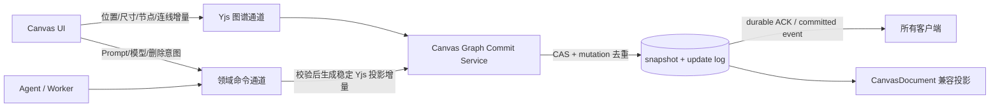
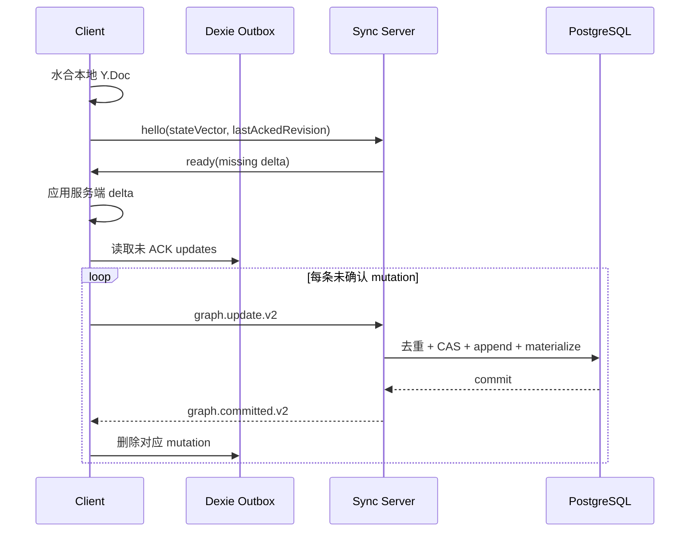

# Botanic Canvas 同步协议 V2：竞品研究与重做方案

> 状态：协议代码与单项目 Canary 工具已就绪；生产状态以逐项目 Canary 的运行报告为准
>
> 日期：2026-08-31
>
> 范围：画布图谱、离线恢复、多端协作、Agent/Worker 写回
>
> 结论：保留现有 Yjs、Dexie、PostgreSQL 与 Redis；停止“Yjs 增量 + HTTP 整文档”双写，改成“可持久化 Yjs 图谱通道 + 权威领域命令通道”。

## 1. 目标、非目标与完成标准

### 目标

- 根除“本地 revision 172、云端 revision 176，始终无法同步”的项目级冲突循环。
- 断网、刷新、丢 ACK、跨 API 实例、Agent/Worker 并发写入时，不丢节点、连线或生成结果。
- 用户只看到“已保存 / 保存中 / 离线待同步 / 同步受阻”，普通图谱并发不再弹整画布二选一冲突框。
- 每份数据只有一个持久化写入权威。

### 非目标

- 不自研 CRDT，不替换 Yjs。
- 不把 GenerationJob、Agent Run、Artifact、计费、审批塞进 CRDT。
- 不同步图片/视频字节、视角、框选和本机选择态。
- 首版不引入全局房间协调服务、二进制 WebSocket、自研跨标签页框架或字符级 Prompt 协同编辑。

### 完成标准

- 3 个浏览器客户端与 1 个 Worker 并发修改后最终图谱一致。
- 断网关闭页面后重开，未确认增量可恢复并自动排空。
- 服务端已提交但客户端未收到 ACK 时，重发不会重复创建节点、活动或 Artifact。
- 两个 API 实例从不同旧状态接收增量时，不会以旧物化图覆盖新日志。
- 截图中的 172/176 场景自动合并；只有同一业务字段的语义冲突才在对应节点局部处理。

## 2. 市面头部产品怎么做

| 产品 | 一手资料中的做法 | 对 Botanic 的启示 |
| --- | --- | --- |
| Figma | WebSocket 连接权威 multiplayer 服务；服务负责校验、排序和冲突处理。文件以内存状态加 checkpoint 保存，并增加带序号的持久化 journal/WAL；通过文件所有权锁防止多实例 split-brain；上线前做暗发布与逐份重建一致性验证。 | 服务端确认必须代表“已经持久化”；快照只是加速，增量日志才负责故障恢复；所有画布写入口必须经过同一持久化门。 |
| Linear | 客户端维护本地数据库；每个 workspace 有不可变、有序、追加式 sync action log；客户端用 checkpoint 只拉缺失增量。PostgreSQL 保持最新数据权威，次级读路径延迟时以重叠区间和 ID 去重兜底；切换前 shadow compare。 | 断线恢复应发送 checkpoint/state vector，而不是重新上传整份画布；mutation ID 和幂等去重是协议基础；迁移先影子比对。 |
| Notion | 将 SQLite 从易失缓存升级为离线持久层；只开放数据完整的离线页面；离线内容迁移到 CRDT；通过推送失效消息和 `lastDownloadedTimestamp` 只补变更页。 | 本地缓存与“待服务端确认的 Outbox”必须分开；离线可用需要完整性保证；恢复只补 delta。 |
| tldraw | 每个文档由服务端权威 room 管理；官方明确要求全局只有一个 room，否则会覆盖他人变更；生产建议持久化存储；客户端和服务端共同校验 schema，并提供旧数据迁移路径。 | 避免多个写权威；协议必须带 schema/version；Presence 与文档持久化分轨；Botanic 当前规模可先用数据库 CAS 达到同一效果，无须立即引入新协调服务。 |
| Yjs | Document update 可交换、可结合、可幂等应用；state vector 可计算缺失增量；官方 IndexedDB provider 支持本地持久化；每个会话应使用独立 client ID。 | 未确认更新可安全重放；握手以 state vector 为主；本地使用现有 Dexie 存 Outbox，不持久化复用 Yjs client ID。 |

共同模式不是某一种算法，而是六条工程纪律：

1. 单一写权威。
2. 提交后才 ACK。
3. 本地持久化 Outbox。
4. 快照 + 增量日志。
5. 稳定 mutation ID 与幂等重放。
6. 协议/schema 可迁移、可观测、可影子验证。

## 3. Botanic 当前根因

### 已有基础

Botanic 已经具备 Yjs、WebSocket、`canvas_graphs`、`canvas_graph_updates`、`graphRevision`、Redis 跨实例事件、Dexie，以及独立 GenerationJob / Agent Run / Artifact。问题不是“缺少实时技术”，而是现有能力没有形成单一提交协议。

### 根因 1：同一图谱存在两个写权威

- `useCanvasWorkspaceSynchronization.ts` 在节点/连线变化时调用 `replaceLocalGraph`，经 Yjs/WebSocket 发送增量。
- 同一份 `CanvasDocument.nodes/edges` 又经 `writeCanvasDocument` 进入 HTTP 整文档/补丁保存。
- Agent/Worker 保存整文档后，`publishProjectUpdatedSafely` 仍携带完整 graph；服务端随后调用 `replaceBaseGraph`，重新压缩并覆盖房间基线。

因此“本地 172、云端 176”不是单纯网络错误，而是两个协议都认为自己能代表最新完整图谱。重试只能反复触发同一冲突。

### 根因 2：WebSocket 的“发送成功”不是“持久化成功”

`projectRealtime.publish()` 只返回 socket 是否已发送，没有 mutation ID、durable ACK 或本地 Outbox。连接在 `send()` 后、数据库提交前后任一点中断，客户端都无法判断应删除、保留还是重发该变更。

### 根因 3：跨实例追加缺少幂等键与 CAS

当前 `appendCanvasGraphUpdate` 接收客户端房间计算出的完整物化 graph，直接将 `canvas_graphs.revision + 1` 并追加 update：

- 没有 `mutation_id` 唯一约束；重试可重复记录。
- 没有 `expectedGraphRevision`/行级 CAS；两个实例可基于旧房间分别计算物化 graph。
- 最后写入的旧物化 graph 可能漏掉另一个实例已经提交的更新，即使日志中两条 update 都存在。

### 根因 4：恢复时权威方向反了

房间从 snapshot + updates 重建后，如果与物化 graph 不一致，当前实现用物化 graph 覆盖 Yjs 文档。正确方向应是：持久化 snapshot + update log 为权威，物化 graph 只是可重建投影。

### 根因 5：节点是整记录粒度

当前 Yjs `nodes` Map 以 node ID 保存整条节点记录。同一节点的“移动位置”和“修改 Prompt/模型配置”并发时，可能互相覆盖。需要分离几何字段与业务配置字段，不需要上 `Y.Text`。

## 4. 目标架构：两条通道，一个提交门



### 数据归属

| 数据 | 唯一权威 | 同步策略 |
| --- | --- | --- |
| 节点存在、位置、尺寸、层级、连线 | 持久化 Yjs 图谱日志 | CRDT delta + durable ACK |
| Prompt、模型参数、重命名、删除意图 | 服务端领域命令 | 乐观 UI + 前置版本校验；成功后投影为 Yjs update |
| GenerationJob / Agent Run / Artifact | 独立服务端实体 | 状态机、幂等键、lease/fencing；不进入 CRDT |
| 图片/视频 | MediaObject / Artifact 引用 | 画布只同步稳定 ID/URL，不同步字节 |
| 视角、框选、当前选择 | 浏览器本地 | 不持久化 |
| Presence | 实时 TTL 状态 | 广播但不写图谱日志 |
| 项目名等元数据 | Project revision | HTTP 领域资源，不携带 nodes/edges |

`CanvasDocument.nodes/edges` 在 V2 中只保留为只读兼容投影，不再接受写入。

## 5. 同步协议 V2

首版继续使用 Base64 JSON，避免引入新编解码依赖；只有监控证明流量/CPU 成为瓶颈后才切二进制帧。

### 5.1 握手

```json
{
  "type": "canvas.sync.hello.v2",
  "protocol": 2,
  "projectId": "project-1788051649823",
  "schemaVersion": 2,
  "clientInstanceId": "session-uuid",
  "stateVectorBase64": "...",
  "lastAckedGraphRevision": 176
}
```

服务端返回客户端缺少的 delta，而非整份画布：

```json
{
  "type": "canvas.sync.ready.v2",
  "protocol": 2,
  "projectId": "project-1788051649823",
  "schemaVersion": 2,
  "graphRevision": 180,
  "updateBase64": "..."
}
```

### 5.2 提交增量

```json
{
  "type": "canvas.graph.update.v2",
  "protocol": 2,
  "projectId": "project-1788051649823",
  "schemaVersion": 2,
  "clientInstanceId": "session-uuid",
  "mutationId": "uuid-v4",
  "baseGraphRevision": 176,
  "updateBase64": "..."
}
```

`baseGraphRevision` 只用于诊断和服务端内部 CAS 起点，不作为普通 CRDT 更新的用户冲突条件。服务端发现版本已前进时，应重载最新状态、重放同一 Yjs update 并内部重试，而不是弹整画布冲突。

### 5.3 Durable ACK / 广播

数据库事务提交后，服务端向发送者和其他客户端发同一 committed 事件：

```json
{
  "type": "canvas.graph.committed.v2",
  "protocol": 2,
  "projectId": "project-1788051649823",
  "mutationId": "uuid-v4",
  "graphRevision": 181,
  "persistedAt": 1788144000000,
  "updateBase64": "..."
}
```

如果服务端已见过 `mutationId`，直接返回原提交的 ACK，不重复写日志或活动。

### 5.4 NACK

```json
{
  "type": "canvas.graph.nack.v2",
  "protocol": 2,
  "projectId": "project-1788051649823",
  "mutationId": "uuid-v4",
  "code": "SCHEMA_UNSUPPORTED",
  "retryable": false
}
```

永久 NACK 仅包括权限撤销、项目删除、schema 不兼容、非法/过大 update。CAS 竞争不是用户冲突；服务端重试耗尽时返回可重试的 `TEMPORARY_UNAVAILABLE`。

HTTP fallback 使用相同 envelope 和响应语义，避免维护第二套协议。

## 6. 客户端状态机与离线 Outbox

### Outbox 记录

使用现有 Dexie，新增增量级记录，不再保存整份待同步 `CanvasDocument`：

```ts
type CanvasSyncOutboxRecord = {
  id: string // projectId:mutationId
  projectId: string
  mutationId: string
  schemaVersion: number
  updateBase64: string
  createdAt: number
  attempts: number
  lastAttemptAt?: number
}
```

本地事务顺序必须是：应用 Yjs update → 写入 Outbox → 尝试发送。只有收到 durable ACK 才删除 Outbox。

### 重连流程



### 用户可见状态

| 状态 | 判定 | UI 文案 |
| --- | --- | --- |
| `synced` | Outbox 为空且已握手 | 已保存 |
| `saving` | 已连接且 Outbox 非空 | 保存中… |
| `offline_pending` | 未连接且 Outbox 非空 | 离线，修改将在联网后同步 |
| `syncing` | 重连并拉取/重放 delta | 正在同步… |
| `blocked` | 永久 NACK | 同步受阻；保留本地修改并给出具体处理方式 |

不再把普通 graphRevision 前进显示为“保留本地 / 放弃本地”。同一 Prompt/模型字段的语义冲突只在对应节点显示局部差异和选择，不阻塞整张画布。

多标签页首版依靠 `mutationId` 唯一约束保证正确性；若重复发送量明显，再用原生 Web Locks + BroadcastChannel 选一个 Outbox flusher。它是优化，不是正确性前提。

## 7. 服务端提交算法

```text
applyGraphUpdate(projectId, mutationId, update):
  1. 鉴权；actor/source 取服务端会话，不信任客户端字段
  2. 校验协议、schema、大小与媒体字节禁入规则
  3. 若 mutation 已提交，返回原 ACK
  4. 读取最新 snapshot + updates + graphRevision
  5. 对最新 Y.Doc 应用 update，生成新物化 graph
  6. 事务内以 expectedGraphRevision 做 CAS：
       - 唯一插入 mutation/update
       - 更新 materialized graph 与 revision
  7. CAS 失败：重载最新状态并重放同一 update，带抖动重试（最多 3 次）
  8. commit 后才发 committed ACK 与 Redis 广播
```

### 数据库最小变化

`canvas_graph_updates` 增加：

- `mutation_id`
- `revision`
- `schema_version`
- `actor_id`
- `source`（browser / agent / worker / migration）
- `payload_sha256`
- 唯一约束 `(project_id, mutation_id)`
- 唯一约束 `(project_id, revision)`

`canvas_graphs` 增加：

- `materialized_through_revision`
- `compacted_through_revision`
- `snapshot_schema_version`

### 快照与恢复

- snapshot 标明压缩到 revision R。
- 压缩事务只删除 `revision <= R` 的更新，不删除并发新写入。
- 恢复顺序是 snapshot → R 之后的 updates → 物化 graph。
- 若物化 graph hash 与日志重建不一致，修复物化投影并报警；禁止反向用物化 graph 覆盖 Y.Doc。

## 8. Agent / Worker 写回

Agent、Generation Worker 和浏览器必须经过同一 `Canvas Graph Commit Service`：

- 生成结果 mutation ID 使用稳定业务身份，例如 `generation:{jobId}:output:{candidateId}`。
- 连线使用稳定身份，例如 `generation:{jobId}:edge:{sourceNodeId}:{candidateId}`。
- Agent patch 使用 `runId + stepId + artifactId`。
- Worker 不再通过整份 `writeProject(document, revision, graphRevision)` 修改 nodes/edges。
- `project.updated` 仅广播项目元数据失效，不携带 graph，也不再触发 `replaceBaseGraph`。
- Job 的成功态以“媒体/Artifact 已持久化且画布投影已提交”为终点；投影尚未提交时保持可恢复的 writeback-pending 状态。
- 用户删除生成节点时记录稳定 projection tombstone；迟到 Worker 结果不得复活节点，但 Artifact 历史继续保留。

## 9. 冲突处理矩阵

| 并发场景 | 处理 |
| --- | --- |
| 不同节点/连线 | Yjs 自动合并 |
| 同节点移动 vs Prompt/配置修改 | 节点拆成 geometry 与 config 字段；两者合并 |
| 同节点移动 vs resize | geometry 子字段合并；同字段按 Yjs 规则收敛 |
| 同一 Prompt/模型字段被两人修改 | 领域命令带 `expectedNodeConfigRevision`；节点局部提示差异 |
| 多个生成输出到达 | 按 job/output/candidate 稳定身份做加法与去重 |
| 用户删除 vs Worker 迟到完成 | tombstone 胜出，Artifact 保留，画布不复活 |
| Job/Run 状态并发 | 服务端状态机 + lease/fencing；不交给 CRDT |
| Presence/视角/选择态 | TTL 或本地态，不参与持久化冲突 |

节点结构只需拆分 `geometry` 与 `config/projection`；没有真实字符级共同编辑需求前，不引入 `Y.Text`。

## 10. 迁移与上线

### Phase 0：先观测

- 给所有 graph 写入打 `source`、revision、project、instance、mutation hash。
- 建立 ACK 延迟、CAS 重试、物化/日志 drift、整文档 graph 写入口等基线。

### Phase 1：先修服务端正确性

- 为全部 ProductStore Adapter 增加 mutation 去重、CAS、revision 日志与 durable ACK 契约。
- 将日志/快照设为权威，物化 graph 改为投影。
- 保持 V1 客户端可读，但先不切换写协议。

### Phase 2：V2 客户端

- 增加 state-vector 握手、Dexie Outbox、ACK/NACK 和 HTTP fallback。
- V2 会话的 HTTP 项目写入剥离 `nodes/edges`。
- 项目一旦进入 V2 epoch，只允许 V2 graph 写；旧客户端要求刷新或只读。允许双读，禁止双写。

### Phase 3：统一 Agent / Worker

- 所有生成和 Agent 画布写回改走 graph commit service。
- `project.updated` 改为 metadata-only，移除 `replaceBaseGraph` 写入路径。

### Phase 4：清理兼容层

- `CanvasDocument.nodes/edges` 变为只读投影。
- 删除整文档 graph pending draft 与项目级 graph conflict UI。
- 完成一次性 backfill 后，再删除 V1 写路径。

### Phase 4 代码侧状态（2026-09-01）

- 已由代码侧收口：epoch ≥ 2 的 ProductStore 整文档 graph 写入与 `project.updated` graph fallback fail-closed；V2 浏览器 HTTP 写入剥离 `nodes/edges`，自动刷新保留本地 Yjs 图谱，项目级 graph conflict UI 仅保留给 epoch 1。
- 保留 epoch 1 的 `replaceBaseGraph` 与兼容保存路径；不改变 durable graph commit、Outbox、tombstone 和版本冲突语义。
- 未执行、也未宣称已完成：Supabase 写入 RPC 的数据库级原子 epoch fence、backfill、生产 epoch 切换、部署、浏览器 UAT 与 SLO 观测。

### 发布策略

1. 暗写日志但不读取，持续比较旧物化 graph 与 snapshot + log 重建 hash。
2. 连续无 drift 后按 5% → 25% → 100% 项目切换。
3. 每个项目记录 `syncProtocolEpoch`，确保任一时刻只有一条写路径。
4. 数据库迁移和生产 backfill 属于数据变更，实施前需维护者明确授权。

### 单项目 Canary 操作

切换工具只接受一个项目，不提供 `--all`。默认是数据库强制只读的 dry-run；只有预检返回
`eligible: true` 后，才使用同一报告里的 `graphRevision` 执行切换。

```bash
npm run canvas:epoch2 -- --project <project-id> --dry-run
npm run canvas:epoch2 -- --project <project-id> --apply --expected-revision <graphRevision>
npm run canvas:epoch2 -- --project <project-id> --verify
```

dry-run 同时检查 V2 唯一索引、历史 mutation 身份回填、活动 Generation/Agent 写入者、Yjs
可恢复性，以及 epoch 2 日志重建与当前物化图谱是否一致。apply 在 `SERIALIZABLE` 事务内锁定
项目图谱行，重新执行全部预检，再原子写入重建快照、切换 epoch 并压缩已合入快照的增量；
revision 或 epoch 变化时整笔回滚。提交后工具自动执行一次 verify，独立 `--verify` 用于后续复核。

任一命令非零退出、`eligible/verified` 为 `false`、线上出现图谱 drift、Outbox 无法排空或 V2
项目 HTTP 409 时，立即停止扩大范围。epoch 2 项目不得把数值改回 1；事故处理是暂停 rollout，
保留 V2 日志权威，并回滚到仍能读取 epoch 2 的应用版本。

### 回滚

- epoch 切换前可直接关闭 V2。
- epoch 切换后，以 V2 日志为权威；回滚客户端只能读取兼容投影，不能重新启用 V1 整文档 graph 写入，否则会重新制造数据丢失。

## 11. 可观测性与 SLO

### SLO

- 同区域 durable ACK p95 < 500ms。
- 重连后 99% Outbox 在 5 秒内排空。
- V2 graph 的项目级 HTTP 409 为 0。
- 物化 graph 与日志重建 drift 为 0。
- 已 ACK mutation 的静默丢失为 0。

### 指标与告警

- `canvas_sync_ack_latency_ms`
- `canvas_sync_outbox_depth` / `oldest_age_ms`
- `canvas_sync_dedupe_total`
- `canvas_sync_cas_retry_total`
- `canvas_sync_reconnect_delta_bytes`
- `canvas_sync_schema_nack_total`
- `canvas_sync_materialized_drift_total`
- `canvas_sync_write_total{source}`

告警：Outbox 最老项 > 60 秒、单 mutation CAS 重试 > 3、drift > 0、永久 NACK 比例 > 1%。日志必须带 projectId、mutationId、graphRevision、instanceId、source，但不得记录媒体字节、Prompt 全文或 Provider 原始推理。

## 12. 验收矩阵

1. 3 个客户端同时改不同节点，最终 state vector/hash 一致。
2. 同节点移动与配置修改同时发生，两者均保留。
3. 服务端 commit 后主动丢 ACK；客户端重发，日志只有一条，收到原 ACK。
4. 离线编辑后关闭并重开浏览器；本地内容立即可见，联网后 Outbox 排空。
5. 两个 API 实例同时接收更新；发生 CAS 重试但无丢更。
6. snapshot 压缩中途进程崩溃；重启可从旧 snapshot + 未删日志恢复。
7. 手工制造物化 graph 过期；系统以日志重建修复并报警。
8. 权限被撤销或 schema 不兼容；本地修改保留，进入 `blocked`，不无限重试。
9. 多标签页重复发送同一 mutation；无重复节点、活动或 Artifact。
10. 复现截图：本地基于 172 编辑期间云端到 176；不出现整画布二选一，最终本地更新获得新 revision 且云端 4 项变更全部保留。

## 13. 实施文件地图

| 模块 | 目标改动 |
| --- | --- |
| `src/lib/projectRealtime.ts` | V2 握手、ACK/NACK、重连与 HTTP fallback |
| `src/lib/projectCollaboration.ts` | 为每个 Yjs update 分配 mutation ID，连接 Outbox |
| `src/lib/db.ts` | 新增增量 Outbox；停止 V2 nodes/edges 整文档 pending sync |
| `src/domain/collaborativeGraph.ts` | 节点拆分 geometry/config 粒度，保持媒体与选择态边界 |
| `server/realtimeHub.mjs` | 鉴权、协议校验、commit 后 ACK/广播 |
| `server/canvasCollaborationRoom.mjs` | state-vector delta、CAS 重载重放、日志权威恢复 |
| `server/productStore.mjs`、`postgresProductStore.mjs`、`supabaseProductStore.mjs` | 同步维护 append/dedupe/CAS/compact 契约与契约测试 |
| `server/projectUpdatePublisher.mjs` | `project.updated` metadata-only |
| Generation/Agent 写回模块 | 改走统一 graph commit service，使用稳定 mutation ID |

建议按 Phase 每阶段一个小提交，不做大爆炸重写。第一阶段只修“服务端可证明不丢数据”；UI 状态和冲突框清理在客户端 V2 稳定后进行。

## 14. 方案选择结论

| 方案 | 结论 | 原因 |
| --- | --- | --- |
| 整文档 revision + 更多重试 | 拒绝 | 只能增加冲突次数，无法合并并发更新，仍会覆盖 Worker 结果。 |
| 自研 OT/操作日志 | 拒绝 | 重复实现 Yjs 已提供的合并与 delta 能力。 |
| 所有数据都放进 Yjs | 拒绝 | 无法正确承载任务 lease、计费、审批、Artifact 血缘和终态约束。 |
| 全局单房间新服务 | 暂缓 | 原理正确，但当前可用 PostgreSQL CAS + 幂等日志解决；CAS 指标证明不够时再引入。 |
| 持久化 Yjs 图谱 + 权威领域命令 | 采用 | 最大复用现有系统，同时消除双写、无 ACK 和跨实例旧图覆盖三个根因。 |

## 15. 一手资料

- [Figma：Making multiplayer more reliable](https://www.figma.com/blog/making-multiplayer-more-reliable/)
- [Linear：Rebuilding Linear’s delta sync read path](https://linear.app/now/rebuilding-delta-sync-read-path)
- [Notion：How we made Notion available offline](https://www.notion.com/blog/how-we-made-notion-available-offline)
- [tldraw sync 官方文档](https://tldraw.dev/docs/sync)
- [Yjs Document Updates](https://docs.yjs.dev/api/document-updates)
- [Yjs IndexedDB persistence](https://docs.yjs.dev/ecosystem/database-provider/y-indexeddb)
- [Yjs FAQ](https://docs.yjs.dev/api/faq)
- [MDN Web Locks API](https://developer.mozilla.org/en-US/docs/Web/API/Web_Locks_API)
- [MDN BroadcastChannel](https://developer.mozilla.org/en-US/docs/Web/API/BroadcastChannel)
